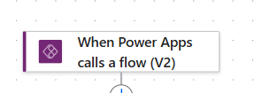
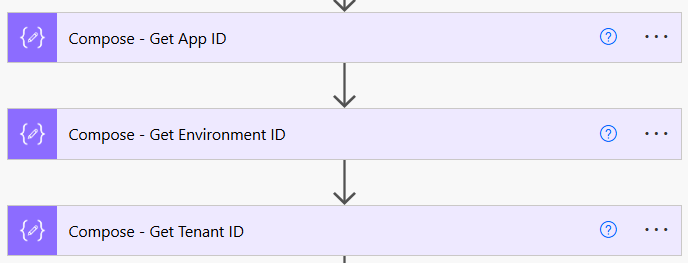
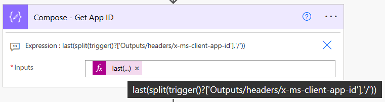
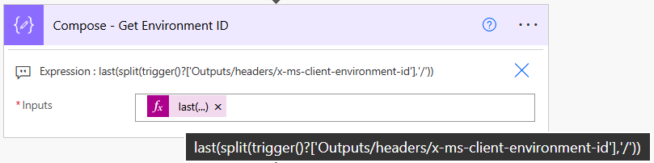
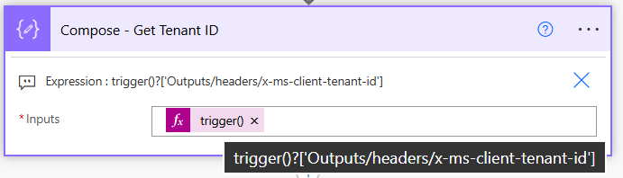

---

title: "Deep Linking in Power Apps: zero config using flow headers"
description: "Build reliable deep links across Dev, Test, and Prod without variables, connectors, or hard-coded IDs."
tags:

* powerapps
* power-automate
* alm
* deep-linking

---

# Deep Linking in Power Apps: zero config using flow headers

Recently I had to implement deep linking in a Canvas app. The plan felt straightforward: use `Param()` to read query strings and jump to the right screen or record. But to build links that work across Dev, Test, and Prod, I also needed the App ID, and ideally the Environment and Tenant IDs, at runtime.

This post follows a simple arc: context, the problem I hit, the solution, and the little trick that finally clicked.

---

## Context

Deep linking lets you open the app directly to the right screen or record, often with URL parameters like `screen=Details` or `recordId=123`. `Param()` reads those values and passes them to the app runtime.

The extra twist is the base of the link. If you want links that survive Dev, Test, and Prod, you need the correct App ID, Environment ID, and Tenant ID. Keeping those in sync across environments can be tedious.

---

## The problem I faced

Most guides suggested either storing IDs in environment variables or hard-coding the App ID from the app details page. Both work, but they add maintenance. From an ALM perspective, I end up tweaking variables or constants during each deployment which can be easy to forget and noisy in pipelines.

---

## Solution

Skip variables and constants. Use a tiny Power Automate flow to read the IDs at runtime from the request headers that Power Apps already sends when it calls the flow. No variables. No connectors. No hard-coding.

**Why it works:** the trigger **When Power Apps calls a flow (V2)** includes headers that contain the App, Environment, and Tenant details for the caller app. Read them, extract the IDs, and return them to Power Apps.

---

## Build the flow

1. Create an **Instant cloud flow** with the trigger **When Power Apps calls a flow (V2)**.

   <figure>
     
     <figcaption>Figure 1. Trigger: When Power Apps calls a flow (V2).</figcaption>
   </figure>

2. Add three **Compose** actions named `Compose - App ID`, `Compose - Environment ID`, and `Compose - Tenant ID`.

   <figure>
     
     <figcaption>Figure 2. Three Compose actions to extract the IDs.</figcaption>
   </figure>

3. In each Compose, paste these expressions:

   **App ID**

   ```text
   last(split(trigger()?['Outputs/headers/x-ms-client-app-id'], '/'))
   ```

   <figure>
     
     <figcaption>Figure 3. Expression for App ID.</figcaption>
   </figure>

   **Environment ID**

   ```text
   last(split(trigger()?['Outputs/headers/x-ms-client-environment-id'], '/'))
   ```

   <figure>
     
     <figcaption>Figure 4. Expression for Environment ID.</figcaption>
   </figure>

   **Tenant ID**

   ```text
   trigger()?['Outputs/headers/x-ms-client-tenant-id']
   ```

   <figure>
     
     <figcaption>Figure 5. Expression for Tenant ID.</figcaption>
   </figure>

4. Add **Respond to a PowerApp or flow** that returns `{ appId, environmentId, tenantId }` mapped from the three Compose outputs.

   <figure>
     
     <figcaption>Figure 6. Respond action returning the three IDs.</figcaption>
   </figure>

---

## Use it in Power Apps

```powerfx
// Call the flow and capture IDs
Set(App_Details, GetAppdetails.Run()); // Sample flow name

// Build a deep link
Set(
    _deepLink,
    $"https://apps.powerapps.com/play/e/{App_Details.environment_id}/a/{App_Details.app_id}?tenantId={App_Details.tenant_id}"
);
```

Display `_deepLink` in a Label or wire it to a Copy button.


---

## Explaining the expression

* `trigger()?['Outputs']['headers']['x-ms-client-app-id']` accesses the x-ms-client-app-id header sent by Power Apps. The trigger exposes headers under Outputs → headers, so navigate into that object to retrieve the header value.
* `split(value, '/')` splits the header string into an array using `/` as the separator (for example, `https://.../apps/12345` becomes `["https:", "", "...", "apps", "12345"]`).
* `last(array)` returns the final element of that array — the App ID. The Environment ID is extracted the same way; the Tenant ID (`x-ms-client-tenant-id`) is already a single value and does not need splitting.

---

## ALM advantages

* Zero maintenance for IDs discovered at runtime.
* Reusable across apps. Headers reflect the caller, so one flow can serve many apps.
* Deployment friendly. Promote across Dev, Test, and Prod without touching variables or constants.

---


Happy deep linking.
